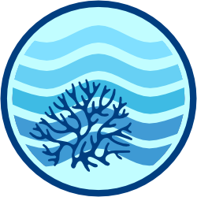

<!-- README.md is generated from README.Rmd. Please edit that file -->

```{r, include = FALSE}
stopifnot(require(knitr))
options(width = 90)
knitr::opts_chunk$set(
  collapse = TRUE,
  comment = "#>",
  fig.path = "man/figures/",
  out.width = "100%"
)
```

```{r, echo = FALSE}
version <- as.vector(read.dcf("DESCRIPTION")[, "Version"])
version <- gsub("-", ".", version)
```

# ereefs 

<!-- badges: start -->
[](https://lifecycle.r-lib.org/articles/stages.html)
<!-- [](https://github.com/open-AIMS/ereefs/actions) -->
<!-- [](https://app.codecov.io/gh/open-aims/ereefs?branch=master) -->
<!--  -->
[](https://choosealicense.com/)
[](https://github.com/open-AIMS/ereefs/issues/new)

<!-- badges: end -->

## Overview 

**What is eReefs?**

[eReefs](https://www.ereefs.org.au/about/) is a project that combines government commitment to reef protection, world-class science innovation and contributions from leading Australian businesses. It is a collaborative information system created (the [Great Barrier Reef Foundation](https://www.barrierreef.org/), [CSIRO](https://www.csiro.au/), the [Australian Institute of Marine Science](https://www.aims.gov.au/), [Bureau of Meteorology](https://www.bom.gov.au/), and [Queensland Government](https://www.qld.gov.au/)) that provides a picture of what is currently happening on the reef, and what will likely happen in the future.

Focused on the protection and preservation of the iconic Great Barrier Reef, it forms the first step in building comprehensive coastal information systems for Australia. Using the latest technologies to collate data, and new and integrated modelling, eReefs will produce powerful visualisation, communication and reporting tools. It will provide for the Reef information akin to that provided by the Bureau of Meteorology for weather. This information will benefit government agencies, Reef managers, policy makers, researchers, industry and local communities.

**What does the `ereefs` R package do?**

The `ereefs` R package provides easy access to
[eReefs](https://www.ereefs.org.au/about/) and other
[CSIRO-EMS](https://research.csiro.au/cem/software/ems/) output files. **`ereefs` focuses on accessing the data from the National Computational Infrastructure (NCI) [eReefs data services](https://dapds00.nci.org.au/thredds/catalog/fx3/gbr4_v2/catalog.html), not the AIMS [eReefs data service](https://hyrax.ereefs.aims.gov.au/).** `ereefs` is designed to assist R users who need more customised access to eReefs data. This includes things like:

* Accessing data from versions of the eReefs model that are not available through the web-based data service;

* Accessing data for less commonly-used variables that are not included in the web-based data service or visualisation portal;

* Generating customised maps or animations for a specified region at a specified depth over a specified period of time, including (for example) true colour maps and animations from modelled optical data, maps that combine two or more eReefs variables (e.g., to get total zooplankton concentrations), maps with labelled points of interest such as Marine Monitoring Program ([MMP](https://www2.gbrmpa.gov.au/our-work/programs-and-projects/marine-monitoring-program)) sampling locations, and maps with outlines of reef areas shown. Maps are created as [`ggplot2`](https://ggplot2.tidyverse.org/) figures and can be further adjusted as required by R users familiar with that package.

* Extracting and visualising data in different ways, for example:
  - Taking a vertical profile of a variable over the depth of the water column and displaying it either as a single profile at a point in time or as a depth-vs-time contour plot;  
  - Taking a two-dimensional vertical slice through the three-dimensional model data;  
  - Calculating vertically integrated results (i.e., the average value of a variable over the depth of the water column rather than the value at a particular depth);  
  - Extracting data along the path of a boat or glider.

## How does this R package compare to the existing eReefs services?

Please see our [online vignette](https://open-aims.github.io/ereefs/articles/about.html) to learn more about how this package compares to the multiple sources of eReefs exploration tools and platforms.

## Installation

To install the latest release from GitHub use

```{r eval=FALSE}
if (!requireNamespace("remotes")) {
  install.packages("remotes")
}
remotes::install_github("open-aims/ereefs")
```

The current development version can be downloaded from GitHub via

```{r eval=FALSE}
if (!requireNamespace("remotes")) {
  install.packages("remotes")
}
remotes::install_github("open-aims/ereefs", ref = "dev")
```

## Usage

Usage and further information about `ereefs` can be seen on the [project
page](https://open-aims.github.io/ereefs/) and the
[vignettes](https://open-aims.github.io/ereefs/articles/). Help files for the
individual functions can be found on the
[reference page](https://open-aims.github.io/ereefs/reference/).

## Further Information

`ereefs` is provided by the [Australian Institute of Marine Science](https://www.aims.gov.au) under the MIT License ([MIT](https://opensource.org/licenses/MIT)).
