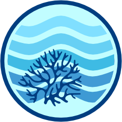

<!-- README.md is generated from README.Rmd. Please edit that file -->

# ereefs 

<!-- badges: start -->

[](https://lifecycle.r-lib.org/articles/stages.html)
<!-- [](https://github.com/open-AIMS/ereefs/actions) -->
<!-- [](https://app.codecov.io/gh/open-aims/ereefs?branch=master) -->

[](https://choosealicense.com/)
[](https://github.com/open-AIMS/ereefs/issues/new)

<!-- badges: end -->

## Overview

**What is eReefs?**

[eReefs](https://www.ereefs.org.au/about/) is a project that combines
government commitment to reef protection, world-class science innovation
and contributions from leading Australian businesses. It is a
collaborative information system created (the [Great Barrier Reef
Foundation](https://www.barrierreef.org/),
[CSIRO](https://www.csiro.au/), the [Australian Institute of Marine
Science](https://www.aims.gov.au/), [Bureau of
Meteorology](https://www.bom.gov.au/), and [Queensland
Government](https://www.qld.gov.au/)) that provides a picture of what is
currently happening on the reef, and what will likely happen in the
future.

Focused on the protection and preservation of the iconic Great Barrier
Reef, it forms the first step in building comprehensive coastal
information systems for Australia. Using the latest technologies to
collate data, and new and integrated modelling, eReefs will produce
powerful visualisation, communication and reporting tools. It will
provide for the Reef information akin to that provided by the Bureau of
Meteorology for weather. This information will benefit government
agencies, Reef managers, policy makers, researchers, industry and local
communities.

**What does the `ereefs` R package do?**

The `ereefs` R package provides easy access to
[eReefs](https://www.ereefs.org.au/about/) and other
[CSIRO-EMS](https://research.csiro.au/cem/software/ems/) output files.
It can work with both the original curvilinear eReefs/EMS outputs hosted
through the National Computational Infrastructure (NCI) [eReefs data
services](https://thredds.nci.org.au/thredds/catalog/catalogs/fx3/catalog.html)
and regularly regridded products that only provide cell centres,
including the AIMS [eReefs data
service](https://thredds.ereefs.aims.gov.au/). Recent updates switch the
package to a `tidync`/`ncmeta`-based access path so it remains usable
against modern THREDDS/OPeNDAP servers. It can also be used to explore
and visualise other CSIRO-EMS model output data, including output from
RECOM model runs. CSIRO-EMS is the hydrodynamic-biogeochemical modelling
software that underpins the eReefs models for the Great Barrier Reef.
RECOM is an online interface that helps registered users to set up
higher-resolution instances of CSIRO-EMS for small areas such as
individual reefs that are nested within the eReefs models.

For depth-resolved variables, the package now treats `layer = "surface"`
as the shallowest wet layer and `layer = "bottom"` as the deepest wet
layer at each time-step. When `eta` is absent from a simple-format
dataset, depth-below-free-surface helpers warn and assume `eta = 0`.
When `z_grid` is absent but `zc` is available, the package reconstructs
layer interfaces from `zc` using midpoint assumptions and resets the top
interface to `1e20` to match the standard EMS convention. For scalar
plotting workflows, `viridis` is now the default colour palette.

`ereefs` is designed to assist R users who need more customised access
to eReefs data. This includes things like:

- Accessing data from versions of the eReefs model that are not
  available through the web-based data service;

- Accessing data for less commonly-used variables that are not included
  in the web-based data service or visualisation portal;

- Generating customised maps or animations for a specified region at a
  specified depth over a specified period of time, including (for
  example) true colour maps and animations from modelled optical data,
  maps that combine two or more eReefs variables (e.g., to get total
  zooplankton concentrations), maps with labelled points of interest
  such as Marine Monitoring Program
  ([MMP](https://www2.gbrmpa.gov.au/our-work/programs-and-projects/marine-monitoring-program))
  sampling locations, and maps with outlines of reef areas shown. Maps
  are created as [`ggplot2`](https://ggplot2.tidyverse.org/) figures and
  can be further adjusted as required by R users familiar with that
  package.

- Working across both grid styles now common in eReefs workflows:

  - curvilinear model grids where cell-corner coordinates are available
    and polygon geometry is needed for plotting;\
  - regular regridded products where only cell centres are supplied and
    the package reconstructs plotting geometry from the centre
    coordinates.

- Extracting and visualising data in different ways, for example:

  - Taking a vertical profile of a variable over the depth of the water
    column and displaying it either as a single profile at a point in
    time or as a depth-vs-time contour plot;\
  - Taking a two-dimensional vertical slice through the
    three-dimensional model data;\
  - Calculating vertically integrated results (i.e., the average value
    of a variable over the depth of the water column rather than the
    value at a particular depth);\
  - Extracting data along the path of a boat or glider.

## How does this R package compare to the existing eReefs services?

Please see our [online
vignette](https://open-aims.github.io/ereefs/articles/about.html) to
learn more about how this package compares to the multiple sources of
eReefs exploration tools and platforms.

## Installation

To install the latest release from GitHub use

``` r
if (!requireNamespace("remotes")) {
  install.packages("remotes")
}
remotes::install_github("open-aims/ereefs")
```

The current development version can be downloaded from GitHub via

``` r
if (!requireNamespace("remotes")) {
  install.packages("remotes")
}
remotes::install_github("open-aims/ereefs", ref = "dev")
```

## Usage

Usage and further information about `ereefs` can be seen on the
[vignettes](https://open-aims.github.io/ereefs/articles/). Help files
for the individual functions can be found on the [reference
page](https://open-aims.github.io/ereefs/reference/).

If you are upgrading from the older `master` workflow, please also read
[NEWS.md](NEWS.md), which summarises the major behavioural and interface
changes in the refactored development version.

## Further Information

`ereefs` is provided by the [Australian Institute of Marine
Science](https://www.aims.gov.au) under the MIT License
([MIT](https://opensource.org/licenses/MIT)).

<!--
metadata:
- gpt_version: GPT-5 Codex
- time: 16:18
- date: 2026-04-26
- prompt_used: "Refactor the eReefs R toolkit away from ncdf4 toward tidync, add regular-grid support alongside curvilinear grids, archive existing R files, and refresh docs/examples."
-->

<!--
metadata:
- gpt_version: GPT-5 Codex
- time: 19:48
- date: 2026-04-26
- prompt_used: "Install dependencies, verify the refactored toolkit, improve efficiency for large THREDDS-served files, and build a working Jupyter demo notebook."
-->

<!--
metadata:
- gpt_version: GPT-5 Codex
- time: 00:01
- date: 2026-04-27
- prompt_used: "Finish the tidy tidync-first refactor, keep it efficient for large live OPeNDAP datasets, validate depth/free-surface logic, audit dependencies, and review plotting palettes."
-->

<!--
metadata:
- gpt_version: GPT-5 Codex
- time: 01:41
- date: 2026-04-27
- prompt_used: "Add a zc-based z_grid reconstruction fallback for simple EMS files, with an explicit warning about the assumptions."
-->

<!--
metadata:
- gpt_version: GPT-5 Codex
- time: 14:09
- date: 2026-04-27
- prompt_used: "After comparing the reconstructed simple-file z_grid to the standard-file z_grid, reset the top interface to 1e20 for macrotidal safety."
-->
<!--
metadata:
- gpt_version: GPT-5 Codex
- time: 15:38
- date: 2026-04-28
- prompt_used: "Document major upgrade-impacting changes in a GitHub-appropriate NEWS file and link the README to it."
-->

<!--
metadata:
- gpt_version: GPT-5 Codex
- time: 08:41
- date: 2026-04-28
- prompt_used: "Update vignette PNGs to match the current code and make viridis the default colour palette."
-->
