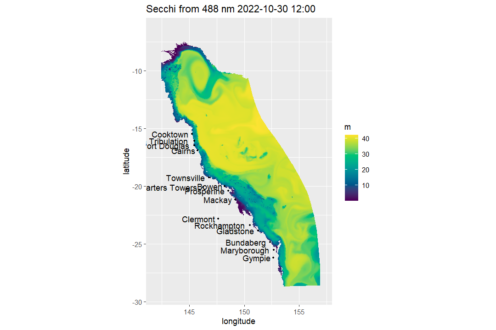
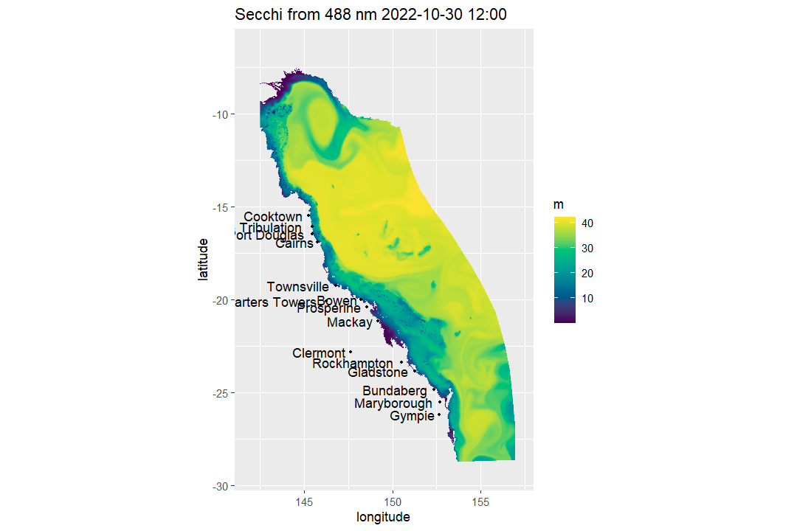
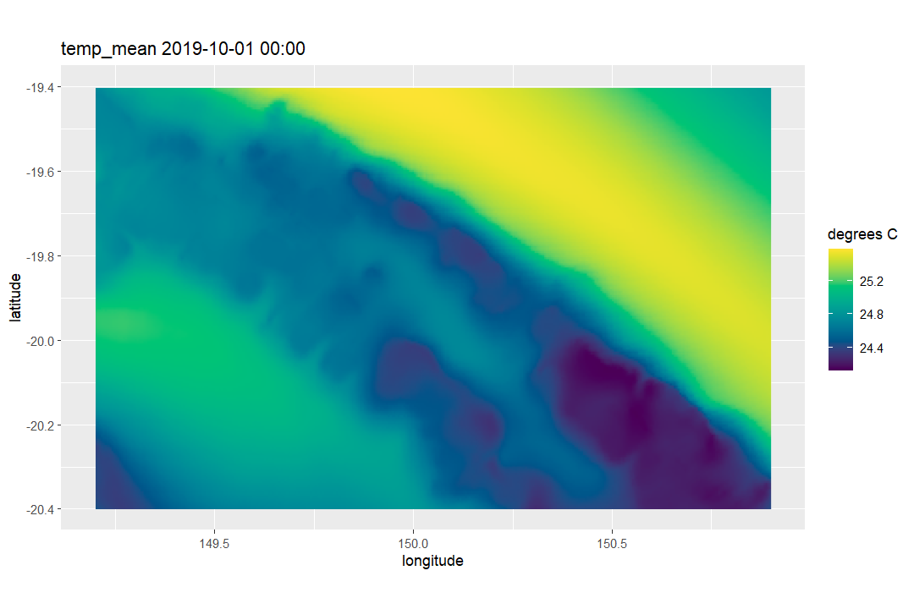
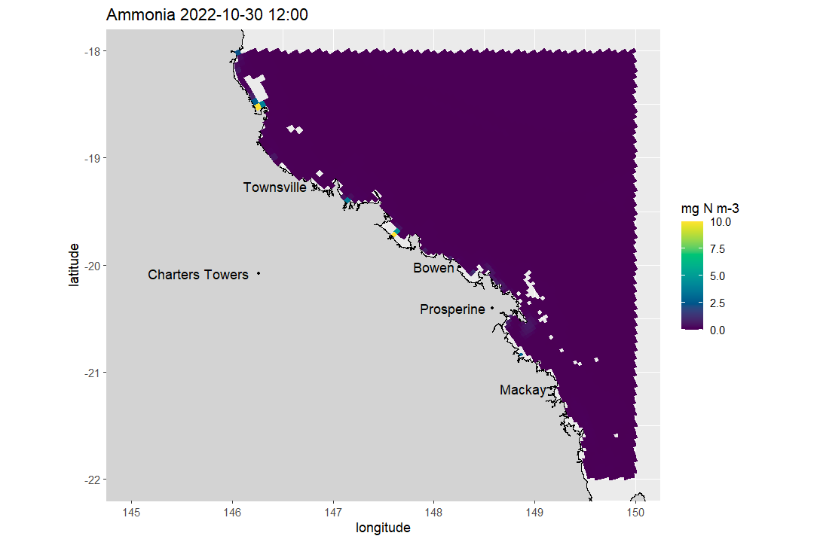
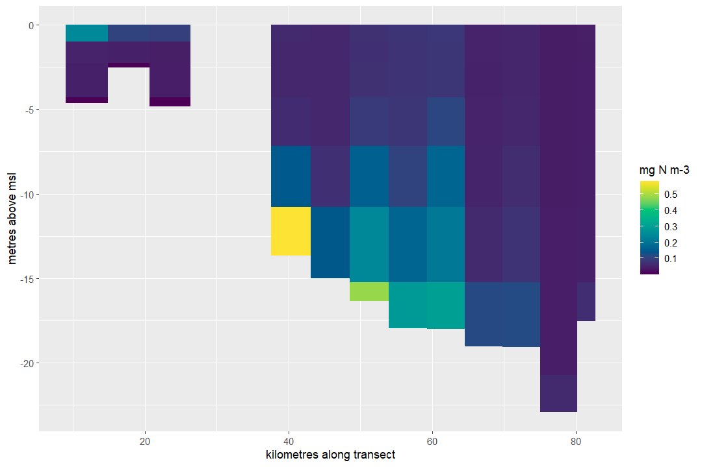
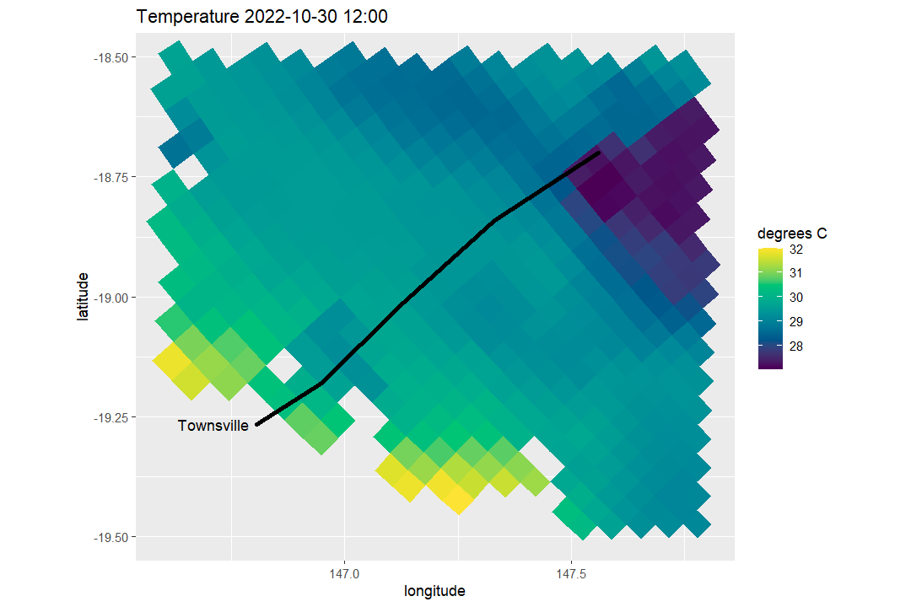
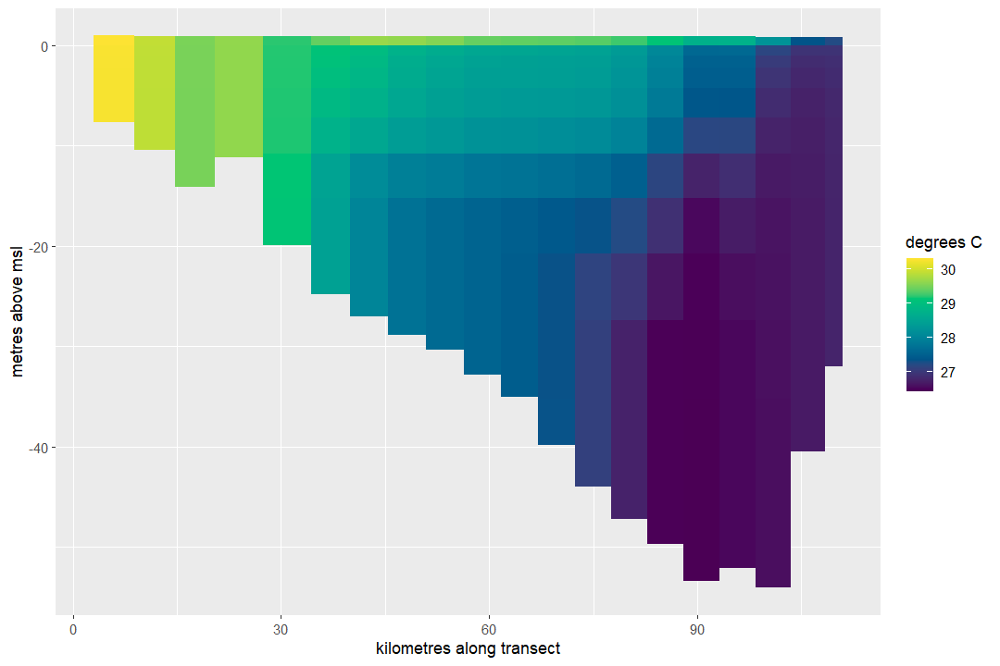
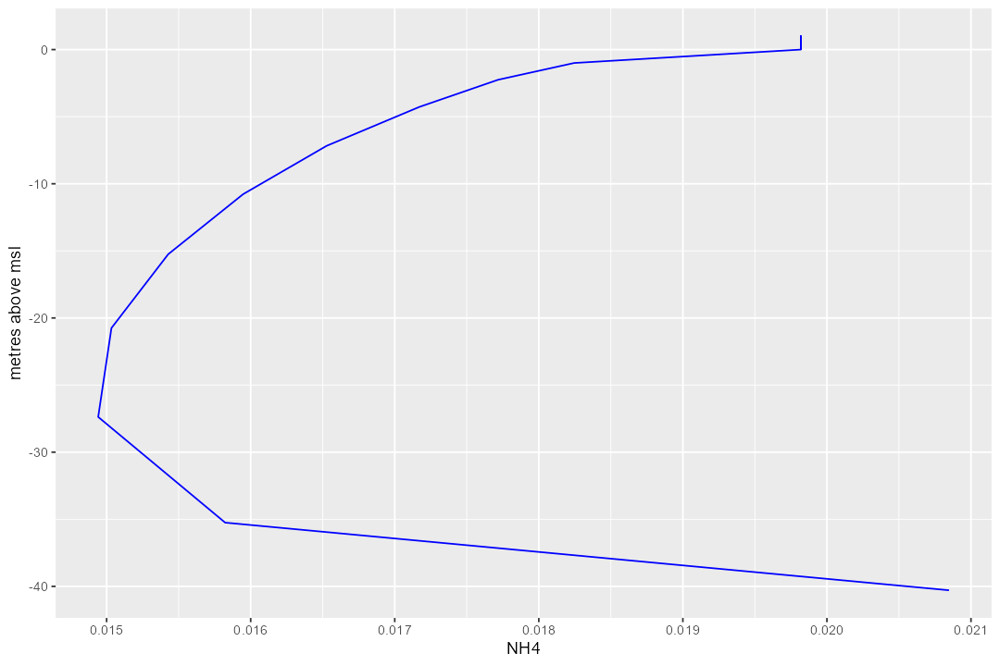
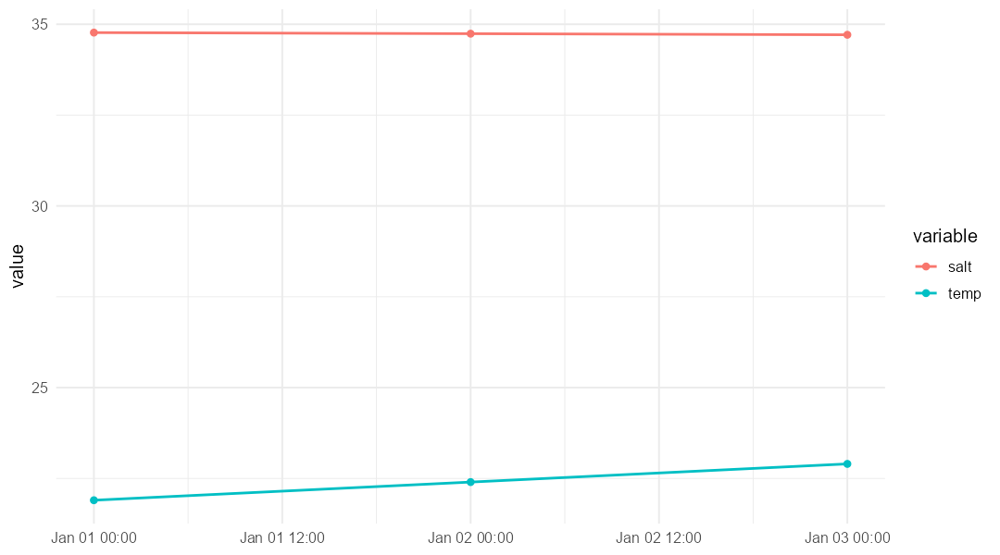
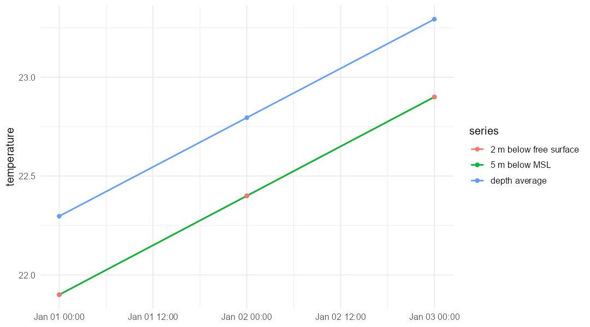

# Overview

This guideline provides a series of practical examples on how a user might take advantage of the functionalities offered by `ereefs`. But first we need to load `ereefs` --- if you have not done so yet, please see our [README page](https://open-aims.github.io/ereefs/) for installation instructions:


```r
library(ereefs)
```

The current package supports both curvilinear EMS files that provide cell corners and regular regridded files that only provide cell centres. The plotting functions detect the available geometry and reconstruct map polygons from centre coordinates when needed. For scalar variables, the default colour palette is now `viridis`.

# Making maps and images for animations from eReefs output

## Static maps

One can create a map of a scalar field such as Secchi depth from a live NCI simple-format file:


```r
map_ereefs(
  var_name = "Secchi", target_date = as.Date("2022-10-30"),
  input_file = "https://thredds.nci.org.au/thredds/dodsC/fx3/gbr4_H4p0_ABARRAr2_OBRAN2020_FG2Gv3_B4p2_Cq5b_Dhnd/gbr4_H4p0_ABARRAr2_OBRAN2020_FG2G_B4p2_Cq5b_Dhnd_simple_2022-10-30.nc"
)
```



If you would prefer a smoother-looking presentation figure, `map_ereefs()` can optionally rasterise the polygons to a regular display grid and interpolate between the display pixels. This only affects how the map is drawn; it does not change the extracted values:

```r
map_ereefs(
  var_name = "Secchi", target_date = as.Date("2022-10-30"),
  input_file = "https://thredds.nci.org.au/thredds/dodsC/fx3/gbr4_H4p0_ABARRAr2_OBRAN2020_FG2Gv3_B4p2_Cq5b_Dhnd/gbr4_H4p0_ABARRAr2_OBRAN2020_FG2G_B4p2_Cq5b_Dhnd_simple_2022-10-30.nc",
  plot_style = "smooth",
  smooth_pixels = 900
)
```



The same plotting path also works on regular-grid products that only provide cell centres. For example, here is a monthly mean surface temperature map from the AIMS regular-grid THREDDS catalog:


```r
map_ereefs(
  var_name = "temp_mean", target_date = as.Date("2019-10-01"),
  input_file = "https://thredds.ereefs.aims.gov.au/thredds/catalog/ereefs/gbr1_2.0/stats-monthly-monthly/catalog.xml",
  box_bounds = c(149.2, 150.9, -20.4, -19.4)
)
```


The colour scale and display style can still be customised explicitly:


```r
map_ereefs(
  var_name = "temp_mean", target_date = as.Date("2019-10-01"),
  input_file = "https://thredds.ereefs.aims.gov.au/thredds/catalog/ereefs/gbr1_2.0/stats-monthly-monthly/catalog.xml",
  box_bounds = c(149.2, 150.9, -20.4, -19.4),
  scale_lim = c(24, 27), plot_style = "smooth", smooth_pixels = 700
)
```



We can also plot different variables such as ammonium at a particular depth (e.g., 5 m below MSL; default is at the surface), add a land map to the plot, and focus on a particular region:


```r
map_ereefs(
  var_name = "NH4", target_date = as.Date("2022-10-30"),
  layer = -5,
  input_file = "https://thredds.nci.org.au/thredds/dodsC/fx3/gbr4_H4p0_ABARRAr2_OBRAN2020_FG2Gv3_B4p2_Cq5b_Dhnd/gbr4_H4p0_ABARRAr2_OBRAN2020_FG2G_B4p2_Cq5b_Dhnd_simple_2022-10-30.nc",
  Land_map = TRUE, box_bounds = c(145, 150, -22, -18), scale_lim = c(0, 10)
)
```



## Images for animations

We can also create the image files needed for a true colour animation of surface salinity in this area. `map_ereefs_movie()` now saves the individual frame images and can also assemble them into a GIF or MP4 directly. Numeric variables use one shared colour scale across all frames by default, so the colours remain comparable from one time-step to the next. Below, `salt_list` is a list that includes the plot handle as well as the temporal mean salinity for each point in the map over the period of the animation, plus the cell centre geo-locations (choose menu option 9). By default, images are saved to the directory `"ToAnimate"`, but can be changed via the argument `output_dir` (**NB: the code below is not run**):


```r
# code not run
map_ereefs_movie(
  var_name = "salt", start_date = c(2019, 2, 15), end_date = c(2019, 3, 10),
  Land_map = TRUE, box_bounds = c(145, 150, -22, -18), scale_col = "viridis",
  scale_lim = c(30, 35), animation_format = "gif"
)
```

# Plotting vertical profiles and slices through the data

The code example below extracts the data from a vertical slice of ammonium along a short transect extending about 60 km offshore from Townsville using live OPeNDAP data from the NCI simple file. A slice can also be defined along a long, curvy line, for example a boat track, by passing a multi-row data frame of latitude and longitude points to `geolocation` in `get_ereefs_slice()`. One can also get data from multiple variables by making `var_names` a vector (e.g., `var_names = c("temp", "salt")`).


```r
temp_slice <- get_ereefs_slice(
  var_names = "NH4",
  target_date = as.POSIXct("2022-10-30 12:00:00", tz = "Etc/GMT-10"),
  geolocation = data.frame(latitude = c(-19.26639219, -19.26639219), longitude = c(146.805701, 147.38)),
  input_file = "https://thredds.nci.org.au/thredds/dodsC/fx3/gbr4_H4p0_ABARRAr2_OBRAN2020_FG2Gv3_B4p2_Cq5b_Dhnd/gbr4_H4p0_ABARRAr2_OBRAN2020_FG2G_B4p2_Cq5b_Dhnd_simple_2022-10-30.nc"
)
```


Now visualise the results:


```r
plot_ereefs_slice(temp_slice, var_name = "NH4", scale_col = "viridis", var_units = "mg N m-3")
```



The same multi-point `geolocation` interface can be used to define a curved or zig-zag transect. Here is a live OPeNDAP example using hydrodynamic temperature data from an arc-shaped transect that bends north-east away from Townsville:


```r
arc_transect <- data.frame(
  latitude = c(-19.26639219, -19.18, -19.02, -18.84, -18.70),
  longitude = c(146.805701, 146.95, 147.12, 147.33, 147.56)
)

arc_slice <- get_ereefs_slice(
  var_names = "temp",
  target_date = as.POSIXct("2022-10-30 12:00:00", tz = "Etc/GMT-10"),
  geolocation = arc_transect,
  input_file = "https://thredds.nci.org.au/thredds/dodsC/fx3/gbr4_H4p0_ABARRAr2_OBRAN2020_FG2Gv3_Dhnd/gbr4_simple_2022-10-30.nc"
)
```

We can map the surface temperature field from the same dataset, then overlay the curved transect path:


```r
library(ggplot2)

arc_map <- map_ereefs(
  var_name = "temp",
  target_date = as.POSIXct("2022-10-30 12:00:00", tz = "Etc/GMT-10"),
  layer = "surface",
  input_file = "https://thredds.nci.org.au/thredds/dodsC/fx3/gbr4_H4p0_ABARRAr2_OBRAN2020_FG2Gv3_Dhnd/gbr4_simple_2022-10-30.nc",
  box_bounds = c(146.6, 147.8, -19.5, -18.5),
  suppress_print = TRUE
) +
  geom_path(
    data = arc_transect,
    aes(x = longitude, y = latitude),
    inherit.aes = FALSE,
    colour = "black",
    linewidth = 1.6,
    lineend = "round"
  )

arc_map
```



Then we can visualise the corresponding vertical slice:


```r
plot_ereefs_slice(
  arc_slice,
  var_name = "temp",
  scale_col = "viridis",
  var_units = "degrees C"
)
```



We can also extract a vertical profile (rather than a slice) at a single location and time from the same live OPeNDAP file:


```r
profile_data <- get_ereefs_profile(
  var_names = "NH4",
  start_date = as.POSIXct("2022-10-30 12:00:00", tz = "Etc/GMT-10"),
  end_date = as.POSIXct("2022-10-30 12:00:00", tz = "Etc/GMT-10"),
  geolocation = c(-19.5, 148.0),
  input_file = "https://thredds.nci.org.au/thredds/dodsC/fx3/gbr4_H4p0_ABARRAr2_OBRAN2020_FG2Gv3_B4p2_Cq5b_Dhnd/gbr4_H4p0_ABARRAr2_OBRAN2020_FG2G_B4p2_Cq5b_Dhnd_simple_2022-10-30.nc"
)
```


Now visualise the results:


```r
plot_ereefs_profile(
  profile_data, var_name = "NH4", target_date = as.POSIXct("2022-10-30 12:00:00", tz = "Etc/GMT-10")
)
```



`get_ereefs_profile()` now favours robustness over low-level NetCDF slicing, which makes it slower for long requests but much less brittle for OPeNDAP-served data.

# Time series

We can also extract a time-series of surface data at a single or multiple specified locations (choose menu option 11):


```r
tsdata <- get_ereefs_ts(
  var_names = c("temp", "salt"),
  start_date = as.POSIXct("2020-01-01 00:00:00", tz = "Etc/GMT-10"),
  end_date = as.POSIXct("2020-01-03 00:00:00", tz = "Etc/GMT-10"),
  geocoordinates = data.frame(latitude = -19.75, longitude = 146.75),
  input_file = "notebooks/demo_data/regular_demo_2020-01.nc"
)
```

For example, we can quickly plot the extracted surface temperature and salinity time-series:

```r
library(ggplot2)

ggplot(tsdata, aes(x = time)) +
  geom_line(aes(y = temp, colour = "temp")) +
  geom_point(aes(y = temp, colour = "temp")) +
  geom_line(aes(y = salt, colour = "salt")) +
  geom_point(aes(y = salt, colour = "salt")) +
  labs(x = NULL, y = "value", colour = "variable")
```



When `input_file` is a THREDDS catalog rather than a single NetCDF file, the package now works out which files are needed to cover the requested period. If the requested period extends beyond what is currently present in that catalog, the available part is returned with a warning.

The locations could even be at all the Marine Monitoring Program routine water quality sampling locations:


```r
mmpdata <- get_ereefs_ts(
  var_names = c("salt", "TN"), geocoordinates = "mmp",
  start_date = c(2018, 1, 1), end_date = c(2018, 2, 28)
)
```

The time-series can also be extract at a specified depth of 5 m below MSL:


```r
deeperdata <- get_ereefs_ts(
  var_names = "temp", geocoordinates = c(-19.75, 146.75),
  start_date = as.POSIXct("2020-01-01 00:00:00", tz = "Etc/GMT-10"),
  end_date = as.POSIXct("2020-01-03 00:00:00", tz = "Etc/GMT-10"),
  layer = -5,
  input_file = "notebooks/demo_data/regular_demo_2020-01.nc"
)
```

For depth-resolved variables, `layer = "surface"` now refers to the shallowest wet model layer at each output time, while `layer = "bottom"` refers to the deepest wet layer. This is more robust in tidally shallow cells where the largest `k` index can occasionally be dry.

One could also have set the argument `layer = "bottom"` to extract a time-series of data at the bottom of the water column. However, to extract a time-series of data averaged over the depth of the water column, the user woul use the function `get_ereefs_depth_integrated_ts`:


```r
intdata <- get_ereefs_depth_integrated_ts(
  var_names = "temp", geocoordinates = c(-19.75, 146.75),
  start_date = as.POSIXct("2020-01-01 00:00:00", tz = "Etc/GMT-10"),
  end_date = as.POSIXct("2020-01-03 00:00:00", tz = "Etc/GMT-10"),
  input_file = "notebooks/demo_data/regular_demo_2020-01.nc"
)
```

Other options include extracting a time-series of the mass per square metre of a variable, integrated over the depth of the water column:


```r
intdatapermass <- get_ereefs_depth_integrated_ts(
  var_names = "temp", geocoordinates = c(-19.75, 146.75),
  start_date = as.POSIXct("2020-01-01 00:00:00", tz = "Etc/GMT-10"),
  end_date = as.POSIXct("2020-01-03 00:00:00", tz = "Etc/GMT-10"),
  input_file = "notebooks/demo_data/regular_demo_2020-01.nc", mass = TRUE
)
```

or extracting a time-series of data at a specified depth below the tidal free surface (rather than below MSL):


```r
tidalintdata <- get_ereefs_depth_specified_ts(
  var_names = "temp", geocoordinates = c(-19.75, 146.75),
  start_date = as.POSIXct("2020-01-01 00:00:00", tz = "Etc/GMT-10"),
  end_date = as.POSIXct("2020-01-03 00:00:00", tz = "Etc/GMT-10"),
  input_file = "notebooks/demo_data/regular_demo_2020-01.nc", depth = 2.0
)
```

Those depth-aware series can also be compared visually:

```r
depth_plot_data <- rbind(
  data.frame(time = deeperdata$time, value = deeperdata$temp, series = "5 m below MSL"),
  data.frame(time = intdata$time, value = intdata$temp, series = "depth average"),
  data.frame(time = tidalintdata$time, value = tidalintdata$temp, series = "2 m below free surface")
)

ggplot(depth_plot_data, aes(x = time, y = value, colour = series)) +
  geom_line() +
  geom_point() +
  labs(x = NULL, y = "temperature")
```



If `eta` is not available in a selected simple-format file, `get_ereefs_depth_specified_ts()` now warns and assumes `eta = 0` instead of stopping. That keeps centre-only simple files usable while making the approximation explicit.

If `z_grid` is absent but `zc` is present in a simple-format file, the package now reconstructs layer interfaces from `zc` using midpoint assumptions and resets the top interface to `1e20` to match the standard EMS convention.

If a single requested timestamp does not exactly match a model output time, the package now falls back to the nearest available time and warns so the substitution is explicit.

<!--
metadata:
- gpt_version: GPT-5 Codex
- time: 16:18
- date: 2026-04-26
- prompt_used: "Refactor the eReefs R toolkit away from ncdf4 toward tidync, add regular-grid support alongside curvilinear grids, archive existing R files, and refresh docs/examples."
-->
<!--
metadata:
- gpt_version: GPT-5 Codex
- time: 19:48
- date: 2026-04-26
- prompt_used: "Install dependencies, verify the refactored toolkit, improve efficiency for large THREDDS-served files, and build a working Jupyter demo notebook."
-->
<!--
metadata:
- gpt_version: GPT-5 Codex
- time: 23:59
- date: 2026-04-26
- prompt_used: "Finish the tidy tidync-first refactor, keep it efficient for large live OPeNDAP datasets, validate depth/free-surface logic, audit dependencies, and review plotting palettes."
-->
<!--
metadata:
- gpt_version: GPT-5 Codex
- time: 00:31
- date: 2026-04-27
- prompt_used: "Fix the smooth map plotting return path and add a vignette example for the opt-in smoother display mode."
-->
<!--
metadata:
- gpt_version: GPT-5 Codex
- time: 01:41
- date: 2026-04-27
- prompt_used: "Add a zc-based z_grid reconstruction fallback for simple EMS files, with an explicit warning about the assumptions."
-->
<!--
metadata:
- gpt_version: GPT-5 Codex
- time: 14:09
- date: 2026-04-27
- prompt_used: "After comparing the reconstructed simple-file z_grid to the standard-file z_grid, reset the top interface to 1e20 for macrotidal safety."
-->
<!--
metadata:
- gpt_version: GPT-5 Codex
- time: 18:18
- date: 2026-04-27
- prompt_used: "Get pandoc working, test the vignettes, and update stale vignette text to match the current animation and live-catalog behavior."
-->
<!--
metadata:
- gpt_version: GPT-5 Codex
- time: 08:41
- date: 2026-04-28
- prompt_used: "Update vignette PNGs to match the current code and make viridis the default colour palette."
-->
<!--
metadata:
- gpt_version: GPT-5 Codex
- time: 08:41
- date: 2026-04-28
- prompt_used: "Refresh the vignette examples so their code and PNG outputs match the new viridis-default plotting behavior."
-->
<!--
metadata:
- gpt_version: GPT-5 Codex
- time: 09:03
- date: 2026-04-28
- prompt_used: "Fix the vignette profile and time-series examples, avoid clipped first-map labels, and add explanatory markdown blocks throughout the notebooks."
-->
<!--
metadata:
- gpt_version: GPT-5 Codex
- time: 09:22
- date: 2026-04-28
- prompt_used: "Fix the remaining howto vignette map clipping, add the missing smooth-map figure, and switch the profile and slice examples to live OPeNDAP data."
-->
<!--
metadata:
- gpt_version: GPT-5 Codex
- time: 17:03
- date: 2026-04-28
- prompt_used: "Document multi-point curved transects in the vignette and add a live hydrodynamic arc-shaped slice example with both a map and slice figure."
-->
