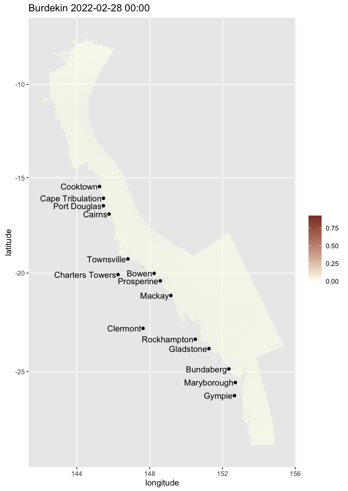
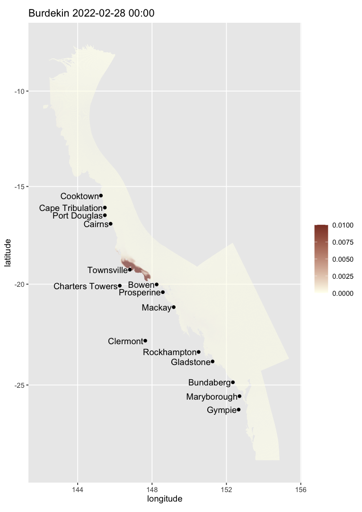
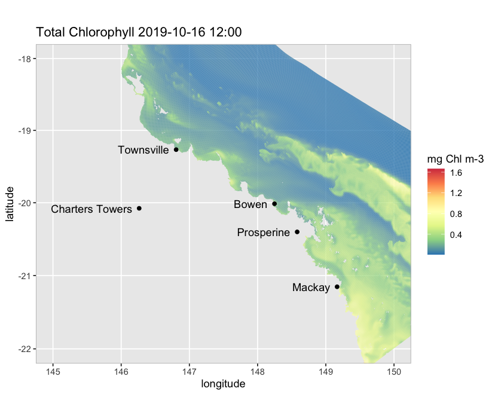
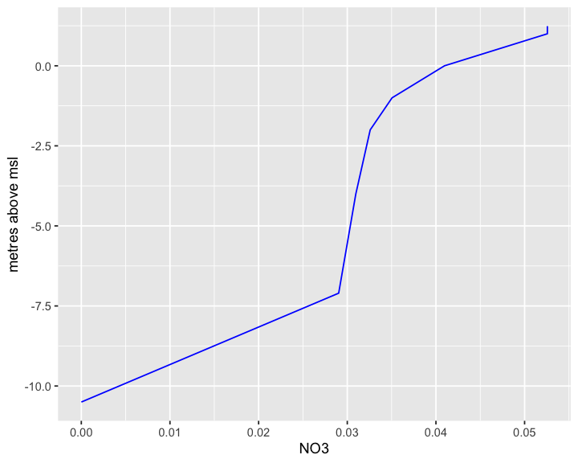

# Overview

This guideline provides a series of practical examples on how a user might take advantage of the functionalities offered by `ereefs`. But first we need to load `ereefs` --- if you have not done so yet, please see our [README page](https://open-aims.github.io/ereefs/) for installation instructions:


```r
library(ereefs)
```

# Making maps and images for animations from eReefs output

## Static maps

One can create a true colour image map from optical model output of the Great Barrier Reef on a specific date (select menu option 9 for high-resolution or 11 for lower resolution):


```r
map_ereefs(target_date = c(2019, 2, 28))
```


It is also possible to map optical colour classes (note the default colour scheme is not great for this, so one might want to add a different colour scale after producing the figure handle):


```r
map_ereefs(var_name = "plume", target_date = c(2019, 2, 28))
```


We can also map, for example, the extent of the influence of the Burdekin River (choose menu option 8 or 7):


```r
map_ereefs(
  var_name = "bur", target_date = c(2022, 2, 28),
  input_file = "https://dapds00.nci.org.au/thredds/dodsC/fx3/gbr1_2.0_rivers/gbr1_rivers_simple_2022-02-28.nc.html"
)
```



The colour scale can be customised. For example, the code below changes the limits of the colour scale so that the max colour intensity is achieved when 1% of water is river water, and change the colours:


```r
map_ereefs(
  var_name = "bur", target_date = c(2022, 2, 28), scale_lim = c(0, 0.01),
  input_file = "https://dapds00.nci.org.au/thredds/dodsC/fx3/gbr1_2.0_rivers/gbr1_rivers_simple_2022-08-28.nc.html"
)
```



We can also plot different variables such as chlorophyll-a at a particular depth (e.g., 5 m below MSL; default is at the surface), add a land map to the plot, and focus on a particular region (choose menu option 9 for higher resolution):


```r
map_ereefs(
  var_name = "Chl_a_sum", target_date = c(2019, 2, 28),
  scale_col = "spectral", Land_map = TRUE, box_bounds = c(145, 150, -22, -18)
)
```



## Images for animations

We can also create the image files needed for a true colour animation of surface salinity in this area (then use [`gifski`](https://cran.r-project.org/web/packages/gifski/index.html) or similar to generate the animation). Below, `salt_list` is a list that includes the plot handle as well as the temporal mean salinity for each point in the map over the period of the animation, plus the cell centre geo-locations (choose menu option 9). By default, images are saved to the directory `"ToAnimate"`, but can be changed via the argument `output_dir` (**NB: the code below is not run**):


```r
# code not run
map_ereefs_movie(
  var_name = "salt", start_date = c(2019, 2, 15), end_date = c(2019, 3, 10),
  Land_map = TRUE, box_bounds = c(145, 150, -22, -18), scale_col = "spectral",
  scale_lim = c(30, 35)
)
```

# Plotting vertical profiles and slices through the data

The code example below extracts the data from a vertical slice of temperature along a line segment at latitude 20 degrees South (choose menu option 2). Note that a slice can also be defined along a long, curvy line, for example a boat track, by adding more points to the `location_latlon` argument in function `get_ereefs_slice`. One can also get data from multiple variables by making `var_names` a vector (e.g., `var_names = c("temp", "salt")`).


```r
temp_slice <- get_ereefs_slice(
  var_names = "temp", target_date = c(2022, 8, 1),
  location_latlon = data.frame(latitude = c(-20, -20), longitude = c(145, 150))
)
```


Now visualise the results:


```r
plot_ereefs_slice(temp_slice, var_name = "temp", scale_col = "spectral")
```


We can also extract a vertical profile (rather than a slice) of, for example, chlorophyll-a and nitrate at a single location and time (choose menu option 11):


```r
profile_data <- get_ereefs_profile(
  var_names = c("Chl_a_sum", "NO3"), start_date = c(2019, 3, 10),
  end_date = c(2019, 3, 10), location_latlon = c(-23.39, 150.89)
)
```


Now visualise the results for NO~3^-^~:


```r
plot_ereefs_profile(
  profile_data, var_name = "NO3", target_date = c(2019, 3, 10)
)
```



We are currently working on improving the function `get_ereefs_profile` so that it can work for multiple time profiles.

We can also extract a time-series of surface data at a single or multiple specified locations (choose menu option 11):


```r
tsdata <- get_ereefs_ts(
  var_names = c("salt", "DIP", "ZooL_N"), start_date = c(2018, 1, 1),
  end_date = c(2018, 2, 28),
  location_latlon = data.frame(
    latitude = c(-23.4, -17), longitude = c(150.9, 147.0)
  )
)
```

The locations could even be at all the Marine Monitoring Program routine water quality sampling locations:


```r
mmpdata <- get_ereefs_ts(
  var_names = c("salt", "TN"), location_latlon = "mmp",
  start_date = c(2018, 1, 1), end_date = c(2018, 2, 28)
)
```

The time-series can also be extract at a specified depth of 5 m below MSL:


```r
deeperdata <- get_ereefs_ts(
  var_names = "Chl_a_sum", location_latlon = c(-23.4, 150.9),
  start_date = c(2018, 1, 1), end_date = c(2018, 2, 28), layer = -5
)
```

One could also have set the argument `layer = "bottom"` to extract a time-series of data at the bottom of the water column. However, to extract a time-series of data averaged over the depth of the water column, the user woul use the function `get_ereefs_depth_integrated_ts`:


```r
intdata <- get_ereefs_depth_integrated_ts(
  var_names = "Chl_a_sum", location_latlon = c(-23.4, 150.9),
  start_date = c(2018, 1, 1), end_date = c(2018, 2, 28)
)
```

Other options include extracting a time-series of the mass per square metre of a variable, integrated over the depth of the water column:


```r
intdatapermass <- get_ereefs_depth_integrated_ts(
  var_names = "Chl_a_sum", location_latlon = c(-23.4, 150.9),
  start_date = c(2018, 1, 1), end_date = c(2018, 2, 28), mass = TRUE
)
```

or extracting a time-series of data at a specified depth below the tidal free surface (rather than below MSL):


```r
tidalintdata <- get_ereefs_depth_specified_ts(
  var_names = "Chl_a_sum", location_latlon = c(-23.4, 150.9),
  start_date = c(2018, 1, 1), end_date = c(2018, 2, 28), depth = 5.0
)
```
